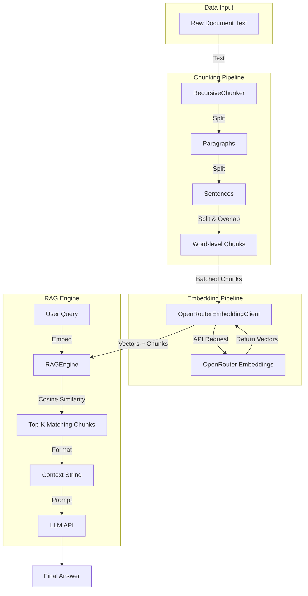
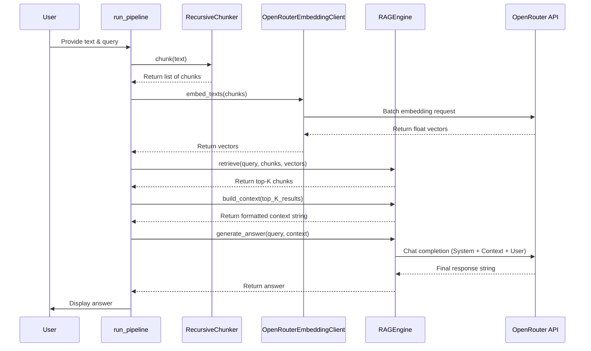

# 🔍 Pure Python RAG — Retrieval-Augmented Generation from Scratch

This repository is **Week 2** of my LLM engineering journey.

After building the [core LLM orchestration layer](https://github.com/hasnatsakil/basic-terminal-Agent) 
in Week 1, I moved into building a full **Retrieval-Augmented Generation (RAG)** 
pipeline from scratch — without using LangChain, LlamaIndex, or any RAG framework.

> Every piece of this system is written in pure Python to understand exactly 
> what happens under the hood.

---

## 🧠 Week 2 — RAG Pipeline from Scratch

### What is RAG?

LLMs only know what they were trained on.  
RAG gives the model access to **your own documents** at query time.

```
Your Document → Chunks → Embeddings → Vector Search → Context → LLM → Answer
```

The model doesn't memorize the document.  
It retrieves the most relevant pieces and uses them to answer.

---

## ✅ Implemented Features

- Custom text chunking with **sliding window overlap**
- Recursive chunking — paragraph → sentence → word level
- Semantic embeddings via **OpenRouter Embedding API**
- **Cosine similarity** computed in pure Python (no numpy)
- Top-K vector retrieval
- Context formatting with **chunk labels** (`[Chunk 1]`, `[Chunk 2]`)
- Strict RAG answering — model cites which chunk it used
- Structured logging per API call
- Multi-provider **fallback routing** via OpenRouter

---

## ⚙️ Core Architecture

```
chunking.py
│
├── RecursiveChunker          ← Splits document into clean chunks
│   ├── _by_paragraph()
│   ├── _by_sentence()
│   └── _by_words()
│
├── OpenRouterEmbeddingClient ← Converts text to vectors
│   ├── embed_text()          ← Single string → one vector
│   └── embed_texts()         ← List of strings → list of vectors
│
├── RAGEngine                 ← Retrieval + Generation
│   ├── retrieve()            ← Finds top-K relevant chunks
│   ├── build_context()       ← Formats chunks for the prompt
│   ├── generate_answer()     ← Calls LLM with context
│   └── debug()               ← Prints scores and chunks
│
└── run_pipeline()            ← Orchestrates the full RAG flow
```

---

## 🔧 Key Engineering Decisions

### Why no NumPy for cosine similarity?
Implemented cosine similarity in raw Python math to understand 
the formula directly — dot product divided by the product of magnitudes.

```python
dot_product = sum(a * b for a, b in zip(vector_a, vector_b))
similarity  = dot_product / (length_a * length_b)
```

### Why classmethods instead of instances?
All classes use `@classmethod` with `cls` instead of instance methods with `self`.  
Config is stored as class attributes (`MAX_WORDS`, `MODEL`), keeping the API clean:

```python
chunks  = RecursiveChunker.chunk(text)
results = RAGEngine.retrieve(question, chunks, embeddings)
answer  = RAGEngine.generate_answer(question, context)
```

### Why recursive chunking?
Flat chunking splits text blindly by word count.  
Recursive chunking respects the natural structure of the document:

```
Paragraph too long?
  └── Split into sentences
        Sentence too long?
          └── Split into word windows with overlap
```

### Why overlap?
Without overlap, meaning at chunk boundaries gets lost.  
With overlap, each chunk shares context with its neighbours.

---

## 📸 Visuals

### High-Level Architecture


### Agentic Execution Flow


---

## 🏗️ Stack

| Layer | Technology |
|---|---|
| LLM API | OpenRouter (multi-provider routing + fallback) |
| Embeddings | `openai/text-embedding-3-small` via OpenRouter |
| Chunking | Pure Python (no framework) |
| Similarity | Pure Python math (no NumPy) |
| Logging | structlog |
| Config | python-dotenv |

---

## 🚀 Getting Started

### 1. Clone and set up environment

```bash
git clone https://github.com/hasnatsakil/pure-python-rag
cd pure-python-rag
python -m venv venv
source venv/bin/activate
pip install -r requirements.txt
```

### 2. Add your API key

```bash
cp .env.example .env
# Add your OPENROUTER_API_KEY to .env
```

### 3. Run the RAG pipeline

```bash
python chunking.py
```

---

## 📌 Key Insight

> Frameworks like LangChain and LlamaIndex are just wrappers around these 
> exact steps: chunk → embed → retrieve → prompt → generate.  
> Building it from scratch means you fully control — and understand — every layer.

---

## 🔜 Next Phase

- PostgreSQL + pgvector for persistent vector storage
- FastAPI backend to serve the RAG pipeline as an API
- PDF ingestion pipeline
- Multi-document retrieval

---

## 📜 License

MIT
