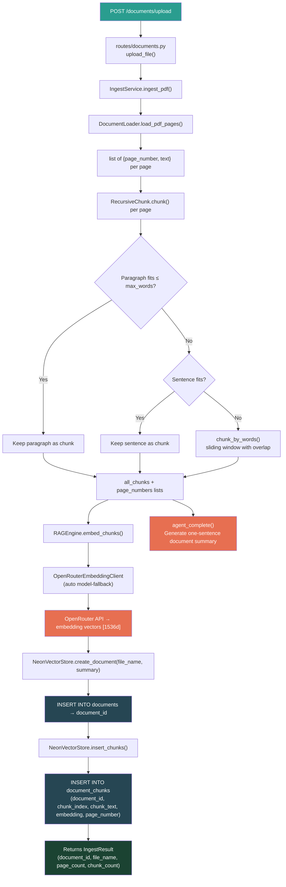
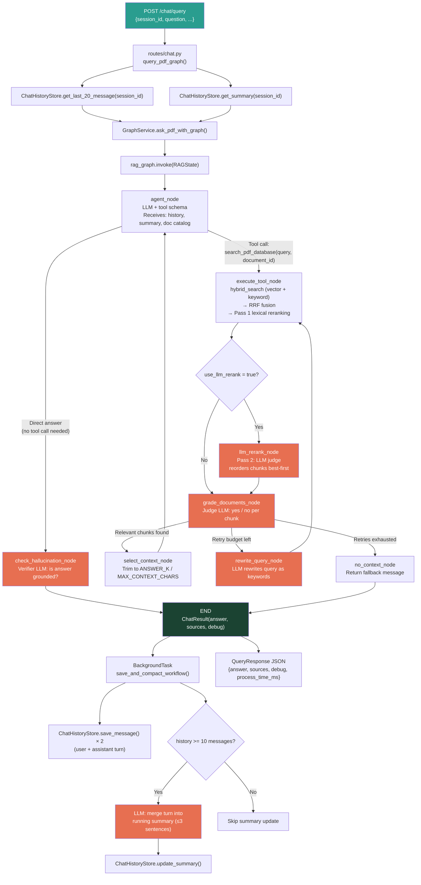
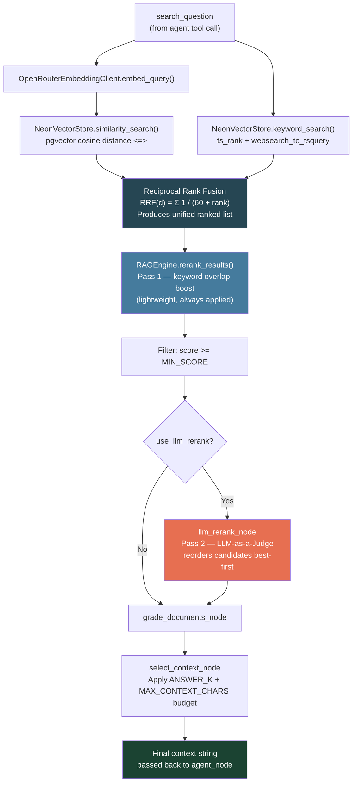
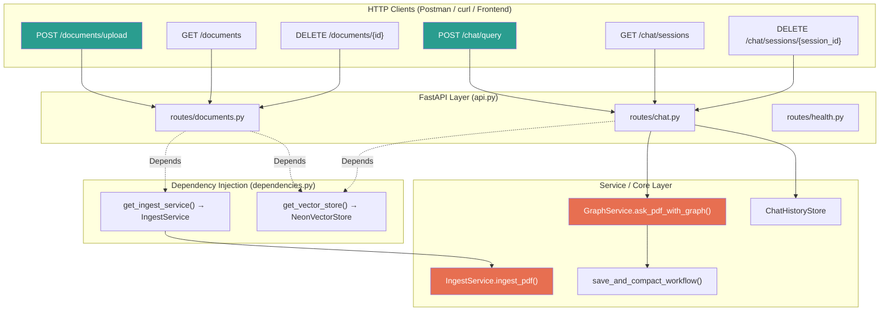
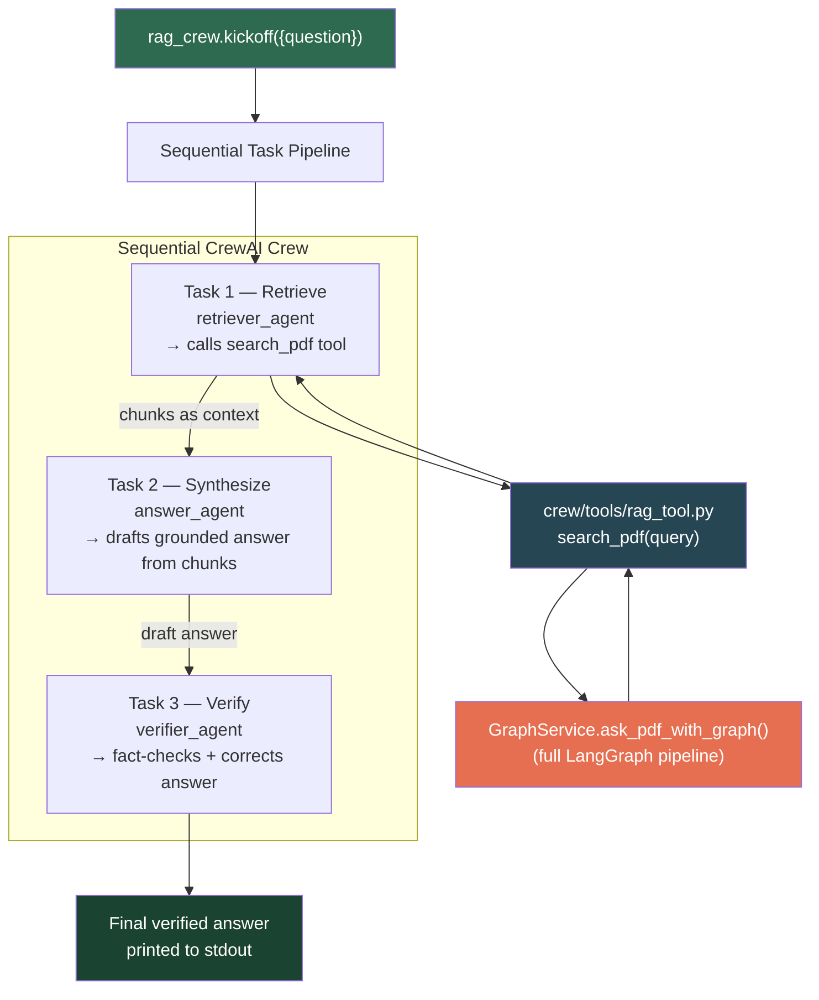

# RAG Project — Code Flow Diagrams

Detailed Mermaid diagrams showing how data flows through every layer of the application.

---

## Flow 1 — PDF Ingestion (`POST /documents/upload`)

---

## Flow 2 — Agentic Chat Query (`POST /chat/query`)

---

## Flow 3 — Hybrid Search & Two-Pass Re-ranking Detail

---

## Flow 4 — Multi-Turn Memory & Session Compaction

```mermaid
flowchart TD
    subgraph "Per Request — Memory Injection"
        R["POST /chat/query\n(session_id, question)"]
        R --> HS["ChatHistoryStore.get_last_20_message(session_id)\nFetches recent turns in chrono order"]
        R --> SS["ChatHistoryStore.get_summary(session_id)\nFetches running summary of older turns"]
        HS & SS --> GS["GraphService → RAGState\nhistory: list[dict]\nsummary: str"]
        GS --> AG["agent_node system prompt receives:\n• Recent chat history (last 20)\n• Summary of older history\n• Available document catalog\n• User question"]
    end

    subgraph "After Response — Background Compaction"
        BG["save_and_compact_workflow()\nFastAPI BackgroundTask"]
        BG --> SM["save_message(user) + save_message(assistant)"]
        SM --> CHK{"Total messages >= 10?"}
        CHK -- Yes --> LLM_S["agent_complete(is_grading=True)\nIntegrate latest turn into\nexisting summary (≤3 sentences)"]
        LLM_S --> US["ChatHistoryStore.update_summary()\nUPSERT into chat_summaries table"]
        CHK -- No --> SKIP["Skip — summary not yet needed"]
    end

    style AG fill:#264653,color:#fff
    style LLM_S fill:#e76f51,color:#fff
    style US fill:#1b4332,color:#fff
```

---

## Flow 5 — API Routing & Service Layer

---

## Flow 6 — CrewAI Multi-Agent Pipeline

---

## Why This Architecture?

Standard RAG pipelines blindly retrieve documents and hand them to the LLM, causing
hallucinations when the context is poor. This service addresses each failure mode explicitly:

| Problem | Solution |
|---|---|
| LLM answers from stale memory instead of searching | Native tool calling — LLM must call `search_pdf_database` and pick the correct document ID |
| Wrong document searched | Agent receives a full catalog with IDs and summaries; it chooses the ID autonomously |
| Poor context quality | `grade_documents_node` evaluates each chunk independently and discards irrelevant ones |
| Retrieval misses the right chunks | `rewrite_query_node` uses an LLM to rephrase the query as keywords before retrying |
| LLM answers go beyond source facts | `check_hallucination_node` cross-references the answer against retrieved chunks |
| Context window overflow over long sessions | `compaction_service` maintains a rolling ≤3-sentence summary in PostgreSQL |
