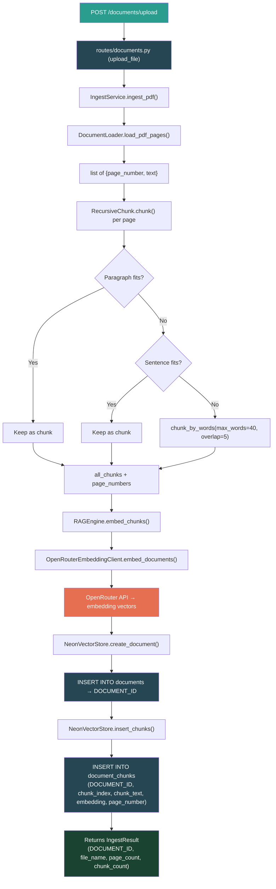
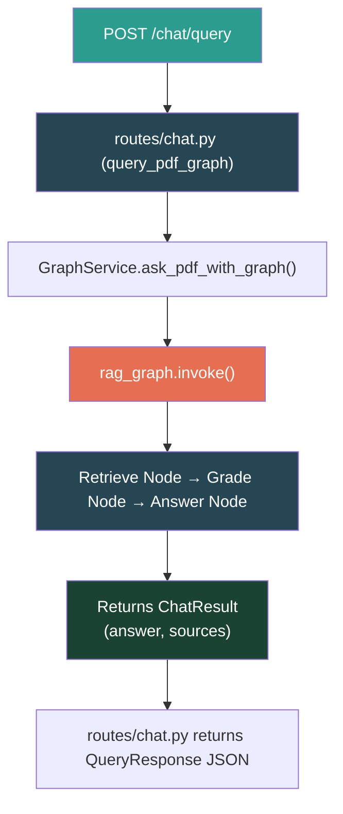
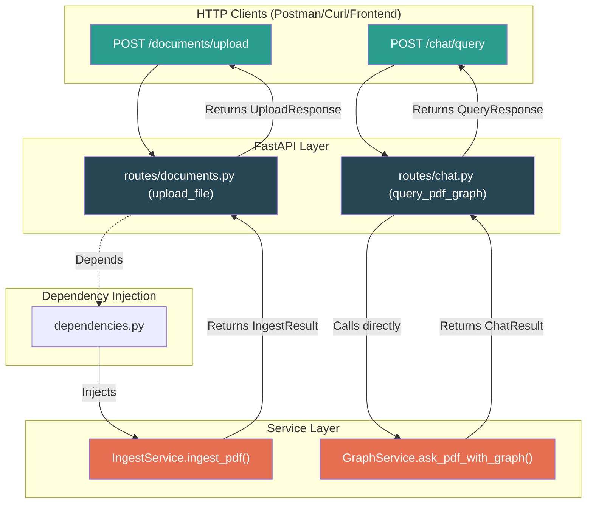
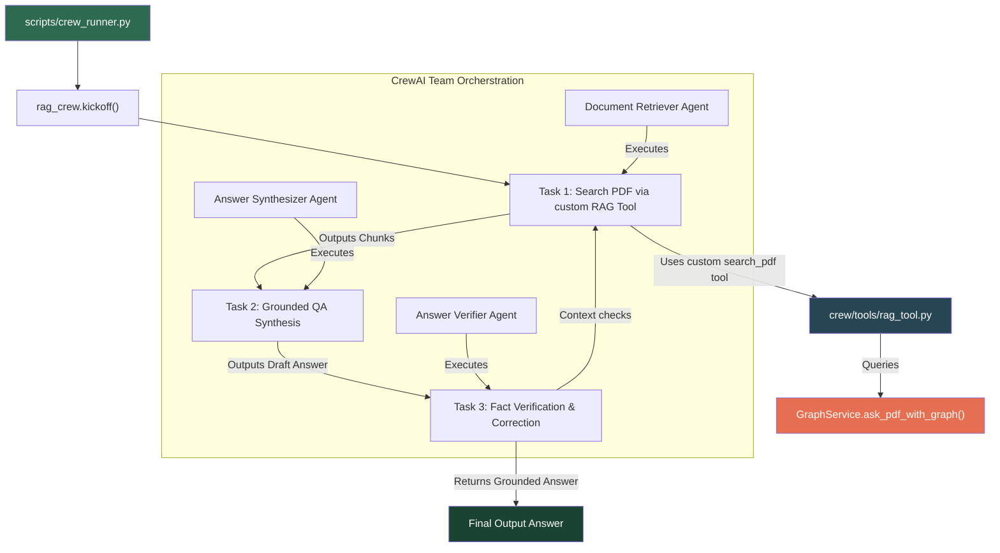
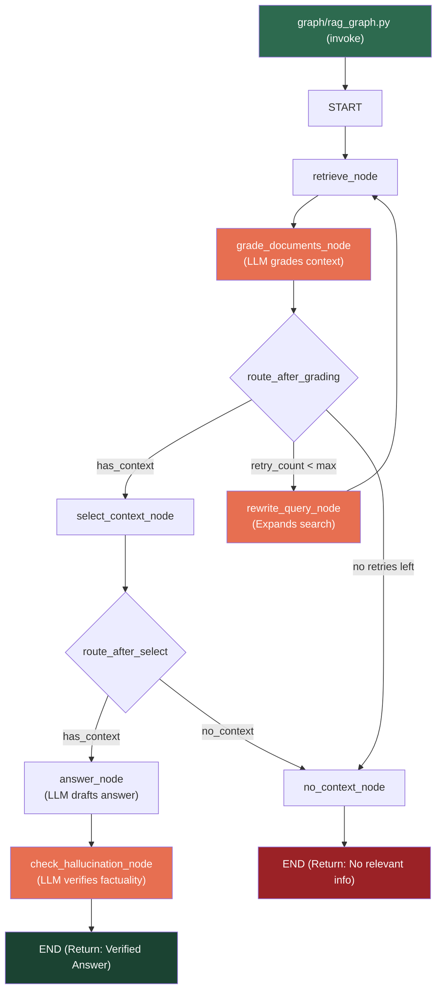

# RAG Project — Code Flow Visual

Detailed diagrams showing how data flows through the application:

## Flow 1: Ingesting a PDF (API Flow)

## Flow 2: Chatting with a PDF (API Query Flow via LangGraph)

## Flow 3: Web API Routing & Services

## Flow 4: CrewAI Collaborative Team Flow

## Flow 5: LangGraph Self-Correcting Flow (Level 9)

### 🧠 Why LangGraph? (The Self-Correcting Architecture)
Standard RAG systems blindly retrieve documents and pass them to an LLM, leading to hallucinations if the context is poor. By using **LangGraph**, this service acts autonomously:
1. **Grading**: It explicitly asks a lightweight LLM-as-a-Judge if the retrieved chunks actually answer the question.
2. **Self-Correction**: If the grade is poor, it automatically rewrites the query and tries again.
3. **Hallucination Prevention**: Before returning the final answer, a strict "Verifier" LLM cross-references the answer against the retrieved chunks. If it detects a hallucination, it flags it.

---

## 🤖 LLM Completion Services

The application implements custom helper functions in [services/agent_completion.py](file:///home/sakil/Documents/LLM%20Learning/test_rag/services/agent_completion.py) to manage LLM interactions through OpenRouter:

*   **`agent_complete()`**: The primary completion function used for answering user queries.
    *   **Default Model**: `minimax/minimax-m2.5:free` (defined via `RouterModel.MINIMAX25.value`).
    *   **Usage**: Handles prompt synthesis and drafting responses from the context.
*   **`grading_complete()`**: A specialized completion function designed for grading and evaluation tasks.
    *   **Default Model**: `google/gemma-4-31b-it:free` (defined via `RouterGradingModel.GEMMA4.value`).
    *   **Usage**: Leveraged by the LangGraph pipeline in:
        *   `grade_documents_node` to evaluate if retrieved chunks are relevant to the user query.
        *   `check_hallucination_node` to verify that the generated answer is strictly grounded in the source context.

---
