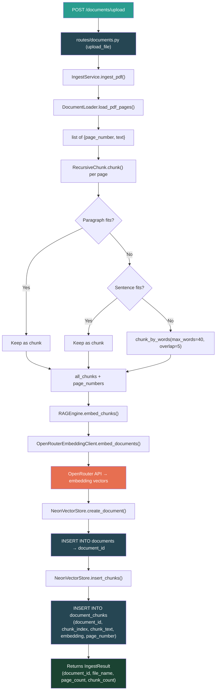
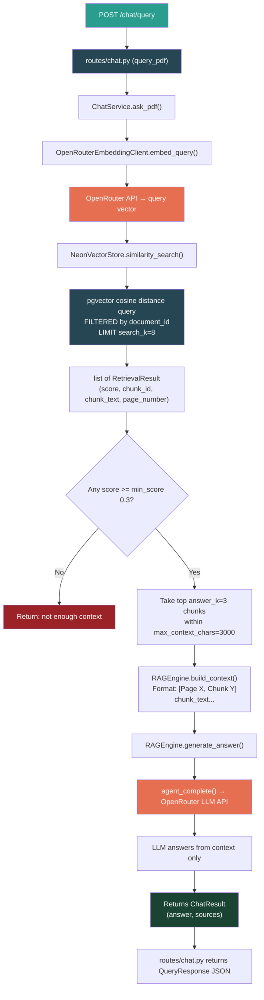
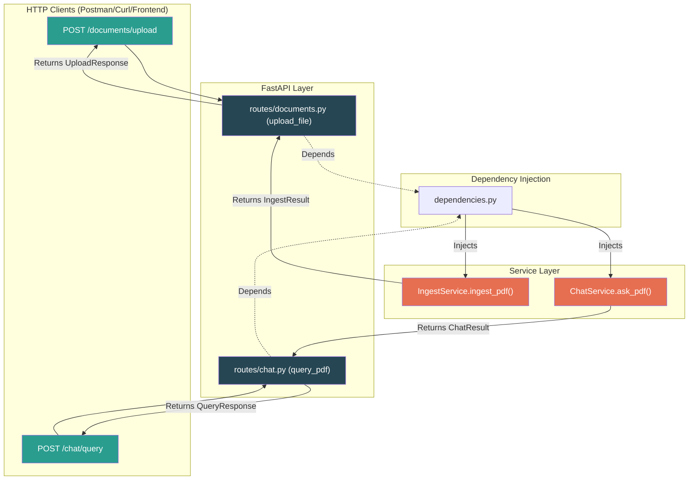
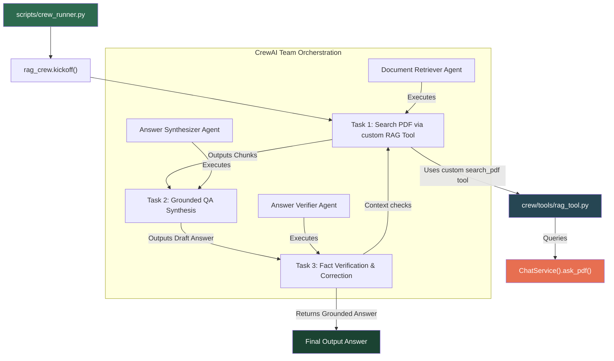
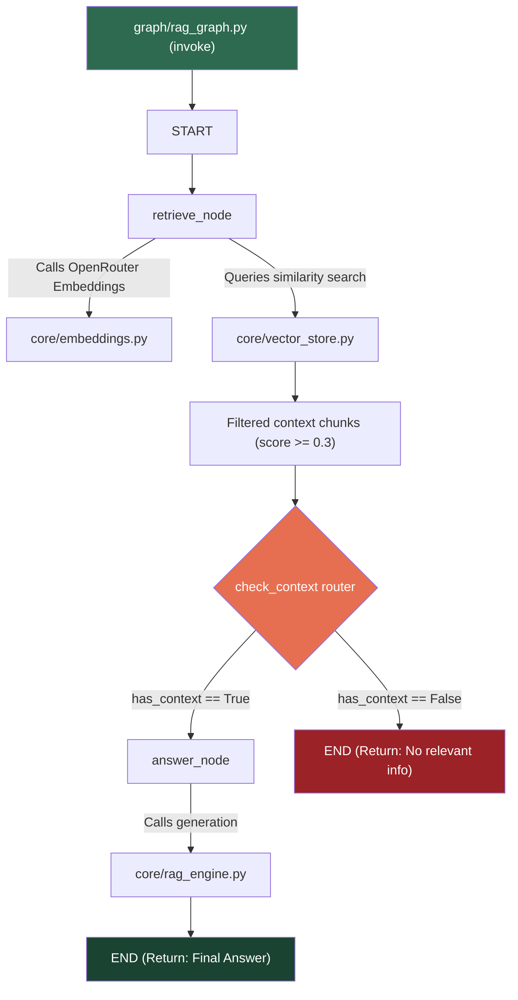
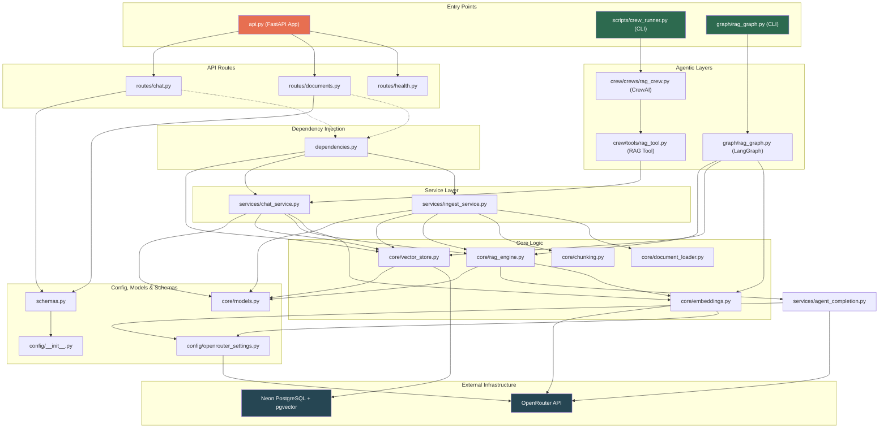

# RAG Project — Code Flow Visual

## Flow 1: Ingesting a PDF (API)

---

## Flow 2: Chatting with a PDF (API Query)

---

## Flow 3: FastAPI Web API Endpoints

---

## Flow 4: CrewAI Collaborative Team Flow

---

## Flow 5: LangGraph Routing State Machine Flow

---

## File Dependency Map

