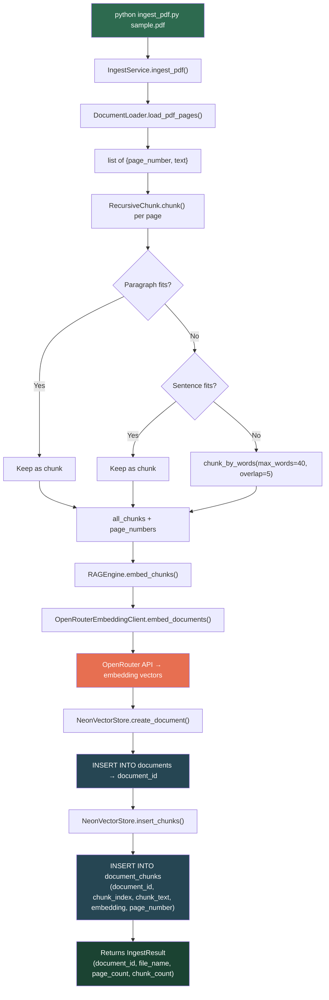
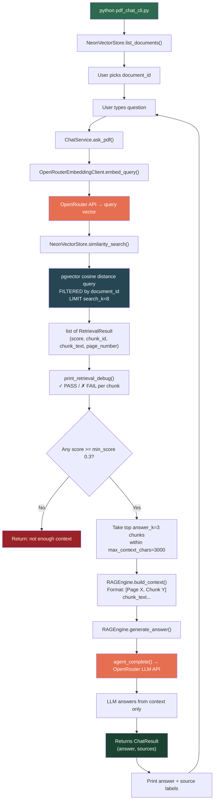
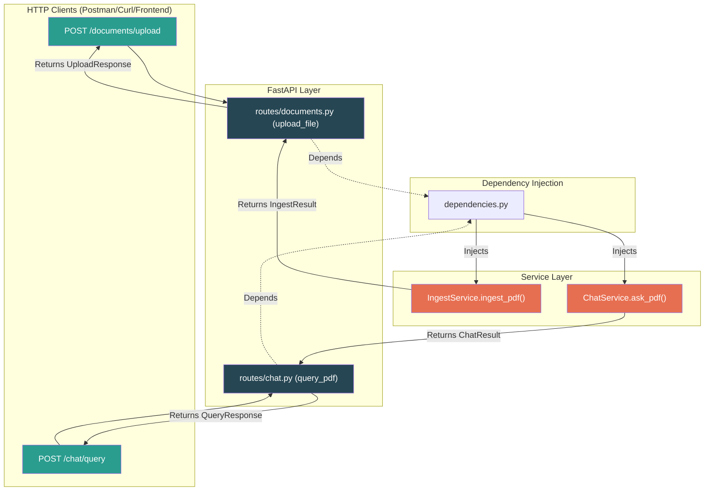
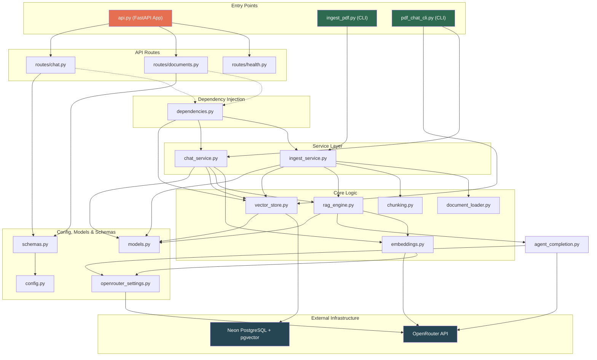

# RAG Project — Code Flow Visual

## Flow 1: Ingesting a PDF

```mermaid
flowchart TD
    A["python ingest_pdf.py sample.pdf"] --> B["IngestService.ingest_pdf()"]
    
    B --> C["DocumentLoader.load_pdf_pages()"]
    C --> D["list of {page_number, text}"]
    
    D --> E["RecursiveChunk.chunk() per page"]
    E --> E1{"Paragraph fits?"}
    E1 -- Yes --> E2["Keep as chunk"]
    E1 -- No --> E3{"Sentence fits?"}
    E3 -- Yes --> E4["Keep as chunk"]
    E3 -- No --> E5["chunk_by_words(max_words=40, overlap=5)"]
    
    E2 & E4 & E5 --> F["all_chunks + page_numbers"]
    
    F --> G["RAGEngine.embed_chunks()"]
    G --> G1["OpenRouterEmbeddingClient.embed_documents()"]
    G1 --> G2["OpenRouter API → embedding vectors"]
    
    G2 --> H["NeonVectorStore.create_document()"]
    H --> H1["INSERT INTO documents → document_id"]
    
    H1 --> I["NeonVectorStore.insert_chunks()"]
    I --> I1["INSERT INTO document_chunks\n(document_id, chunk_index, chunk_text, embedding, page_number)"]
    
    I1 --> J["Returns IngestResult\n(document_id, file_name, page_count, chunk_count)"]

    style A fill:#2d6a4f,color:#fff
    style J fill:#1b4332,color:#fff
    style G2 fill:#e76f51,color:#fff
    style H1 fill:#264653,color:#fff
    style I1 fill:#264653,color:#fff
```

---

## Flow 2: Chatting with a PDF

```mermaid
flowchart TD
    A["python pdf_chat_cli.py"] --> B["NeonVectorStore.list_documents()"]
    B --> C["User picks document_id"]
    C --> D["User types question"]
    
    D --> E["ChatService.ask_pdf()"]
    
    E --> F["OpenRouterEmbeddingClient.embed_query()"]
    F --> F1["OpenRouter API → query vector"]
    
    F1 --> G["NeonVectorStore.similarity_search()"]
    G --> G1["pgvector cosine distance query\nFILTERED by document_id\nLIMIT search_k=8"]
    G1 --> G2["list of RetrievalResult\n(score, chunk_id, chunk_text, page_number)"]
    
    G2 --> H["print_retrieval_debug()\n✓ PASS / ✗ FAIL per chunk"]
    
    H --> I{"Any score >= min_score 0.3?"}
    I -- No --> I1["Return: not enough context"]
    I -- Yes --> J["Take top answer_k=3 chunks\nwithin max_context_chars=3000"]
    
    J --> K["RAGEngine.build_context()\nFormat: [Page X, Chunk Y]\nchunk_text..."]
    
    K --> L["RAGEngine.generate_answer()"]
    L --> L1["agent_complete() → OpenRouter LLM API"]
    L1 --> L2["LLM answers from context only"]
    
    L2 --> M["Returns ChatResult\n(answer, sources)"]
    M --> N["Print answer + source labels"]
    N --> D

    style A fill:#2d6a4f,color:#fff
    style I1 fill:#9b2226,color:#fff
    style F1 fill:#e76f51,color:#fff
    style G1 fill:#264653,color:#fff
    style L1 fill:#e76f51,color:#fff
    style M fill:#1b4332,color:#fff
```

---

## Flow 3: FastAPI Web API Endpoints

```mermaid
flowchart TD
    subgraph Client["HTTP Clients (Postman/Curl/Frontend)"]
        C1["POST /documents/upload"]
        C2["POST /chat/query"]
    end

    subgraph API["FastAPI Layer"]
        R_DOC["routes/documents.py (upload_file)"]
        R_CHAT["routes/chat.py (query_pdf)"]
    end

    subgraph DI["Dependency Injection"]
        D1["dependencies.py"]
    end

    subgraph Services["Service Layer"]
        IS["IngestService.ingest_pdf()"]
        CS["ChatService.ask_pdf()"]
    end

    C1 --> R_DOC
    C2 --> R_CHAT

    R_DOC -.->|Depends| D1
    R_CHAT -.->|Depends| D1
    
    D1 -->|Injects| IS
    D1 -->|Injects| CS

    IS -->|Returns IngestResult| R_DOC
    CS -->|Returns ChatResult| R_CHAT

    R_DOC -->|Returns UploadResponse| C1
    R_CHAT -->|Returns QueryResponse| C2

    style C1 fill:#2a9d8f,color:#fff
    style C2 fill:#2a9d8f,color:#fff
    style R_DOC fill:#264653,color:#fff
    style R_CHAT fill:#264653,color:#fff
    style IS fill:#e76f51,color:#fff
    style CS fill:#e76f51,color:#fff
```

---

## File Dependency Map

```mermaid
flowchart TD
    subgraph Entry["Entry Points"]
        API["api.py (FastAPI App)"]
        IP["ingest_pdf.py (CLI)"]
        PC["pdf_chat_cli.py (CLI)"]
    end

    subgraph API_Routes["API Routes"]
        RH["routes/health.py"]
        RD["routes/documents.py"]
        RC["routes/chat.py"]
    end

    subgraph Dependency["Dependency Injection"]
        DEP["dependencies.py"]
    end

    subgraph Services["Service Layer"]
        IS["ingest_service.py"]
        CS["chat_service.py"]
    end

    subgraph Core["Core Logic"]
        RE["rag_engine.py"]
        CH["chunking.py"]
        DL["document_loader.py"]
        EM["embeddings.py"]
        VS["vector_store.py"]
    end

    subgraph Config_Models["Config, Models & Schemas"]
        CONF["config.py"]
        SCH["schemas.py"]
        OR["openrouter_settings.py"]
        MD["models.py"]
    end

    subgraph External["External Infrastructure"]
        NE["Neon PostgreSQL + pgvector"]
        OA["OpenRouter API"]
    end

    %% Routing Flow
    API --> RH
    API --> RD
    API --> RC

    %% Dependency Connections
    RD -.-> DEP
    RC -.-> DEP
    DEP --> IS
    DEP --> CS
    DEP --> VS

    %% CLI Connections
    IP --> IS
    PC --> CS
    PC --> VS

    %% Service Connections
    IS --> DL
    IS --> CH
    IS --> RE
    IS --> VS
    
    CS --> EM
    CS --> RE
    CS --> VS

    %% Core Connections
    RE --> EM
    RE --> AC["agent_completion.py"]
    EM --> OR
    AC --> OR
    VS --> NE

    %% Configuration & Schema usage
    RD & RC --> SCH
    SCH --> CONF
    VS & IS & CS & RE --> MD
    OR & AC & EM --> OA

    style API fill:#e76f51,color:#fff
    style IP fill:#2d6a4f,color:#fff
    style PC fill:#2d6a4f,color:#fff
    style NE fill:#264653,color:#fff
    style OA fill:#264653,color:#fff
```

